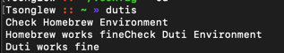
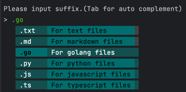
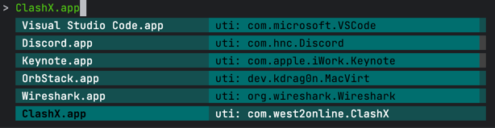

# Dutis

A command-line tool to select default applications. It is a wrapper around `duti` commands.

## Installation

```shell
$ go install github.com/tsonglew/dutis@latest
```

## Usage 

```shell
$ dutis
```

## Screenshots

1. Waiting for environment checking



2. Selecting suffix



3. Selecting application UTI
 

