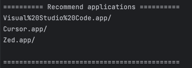
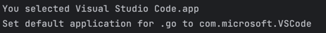

# Dutis

A command-line tool to select default applications. It is a wrapper around [duti](https://github.com/moretension/duti).

## Installation

```shell
$ go install github.com/tsonglew/dutis@latest
```

## Usage 

```shell
$ dutis
```

## Screenshots

1. Waiting for environment checking

    

2. Selecting suffix

    

3. Checking recommended applications

    

4. Selecting application UTI
 
    

5. Finished

    
